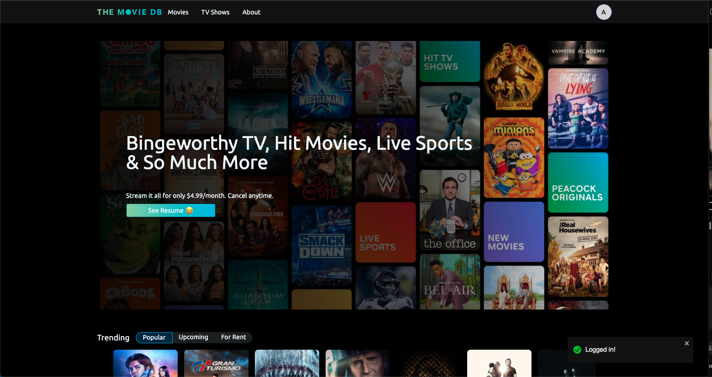
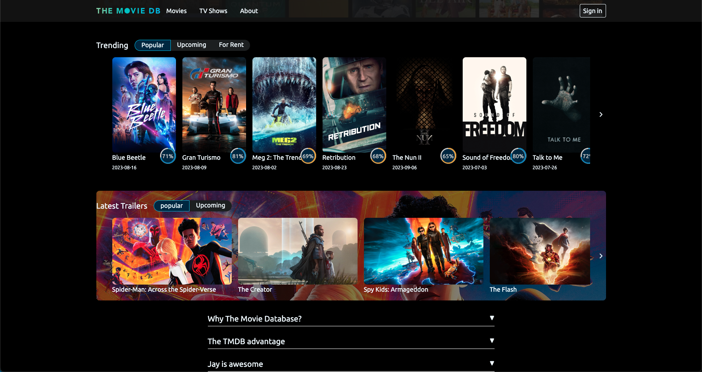
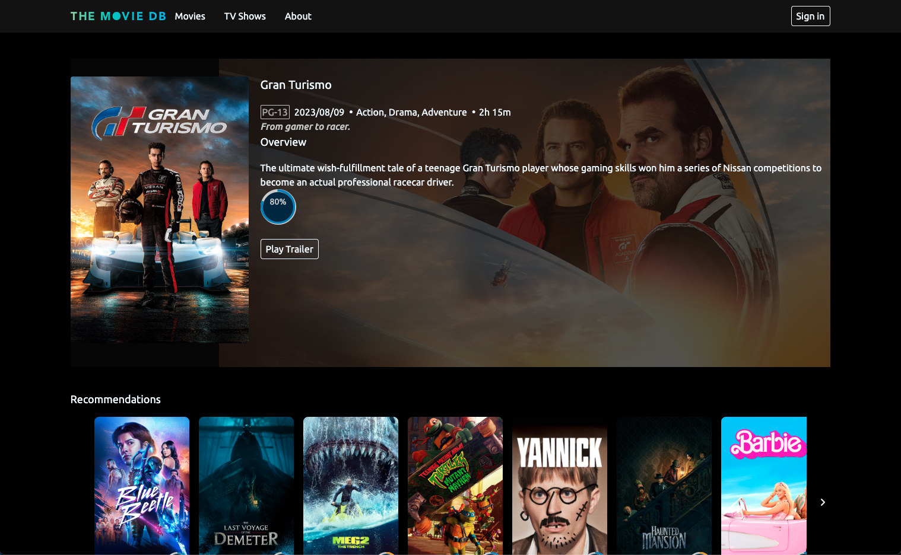
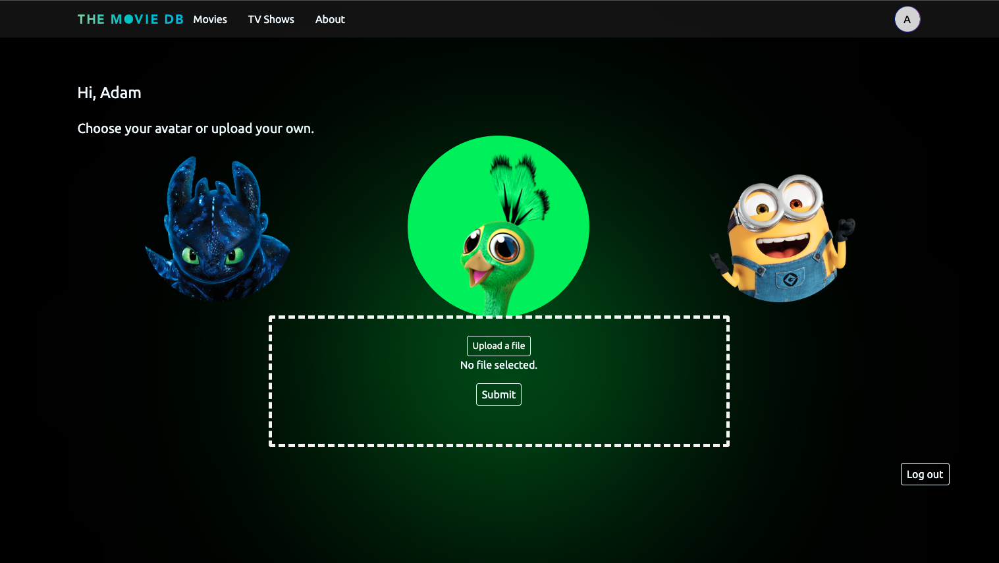
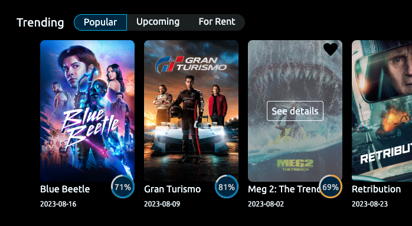
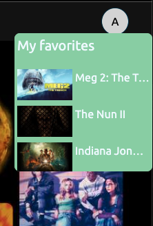

## A Clone Project - Streaming Site

A mock web application with data from The Movie Database, built with React, Redux, Typescript, SCSS, TailwindCSS, and Firebase.
Demo: https://jayohtmdb.netlify.app/home 

## Explanation
The Movie Database provides vast amount of movie/TV data and actors. With the TMDB data, I'm building my own kingdom that looks like any streaming site such as Netflix. It's not following the exact same design or pattern from a company's site. Instead, I add things that I think it's cool. For example, the home page design is mostly coming from TMDB but the profile page is Peacock style. It's my playground to teach myself about front-end skills. 

## Project Status

This project is currently in development as I keep adding features and sophisticating the project. I still see a lot of bugs I need to fix as I develop so bear with me.

## Project Screen Shots
### Home page as logged In
Emphasizing on the most important thing - the button to my resume 😁

### Browsing on Home page
`Tab`, `Card Slider`, `Card` components.

### Movie Detail page

### Profile page
Users can either choose a character or upload their profile image.

### Save favorites
When logged in, it allows users to save their favorites and it will show on the profile button when the mouse is hovered. 

### Installation and Setup Instructions

Clone down this repository. You will need node and npm installed globally on your machine.

Installation:

`npm install`

To Start Server:

`npm start`

To Visit App:

`localhost:3000/`

## Reflection

I'm still building this project as I practice things I'm not familiar with. So, far I learned
- Clean code is important. I don't want to come back later simply because I code sloppy this time to make things work. 
- Don't get too scared of messing things around. The worst thing that can happen is to break this project. I can go back to the previous commit. 😝
- Consistency is the key. 💪